# Introspection and Visualization

Symbiont exposes introspection capabilities that allow you to **inspect the application
structure it builds at runtime**, rather than treating it as a black box.

Introspection is **observational only**. It does not affect execution order,
lifecycle behavior, or dependency resolution.

It is primarily useful for:

- understanding how dependencies are wired
- validating application structure in tests
- debugging complex setups
- documenting and reviewing architectural decisions

## What Can Be Inspected

At runtime, Symbiont tracks:

- registered initializers and hosted runnables
- dependency registrations and resolutions
- configuration keys and providers used
- caller information (function and file location)

This information is aggregated into an introspection report once the application
lifecycle completes.

## Enabling Introspection

To enable introspection, register an introspector on the application.

An introspector implements the following interface:

```go
type Introspector interface {
	Introspect(ctx context.Context, r introspection.Report) error
}
```

The introspector is invoked **after initialization and wiring complete** — meaning all
initializers have executed and all dependency and configuration injection has been
resolved — **but before any runnables start executing**.

This places introspection at the boundary between **wiring** and **execution**, allowing
you to inspect the fully constructed application graph without affecting runtime behavior.

## Generating Dependency Graphs (Mermaid)

Symbiont includes built-in support for generating **Mermaid diagrams** directly
from the introspection report.

A common and idiomatic pattern is to use an introspector with an **injected logger**
and log the generated Mermaid graph when the application shuts down.

```go
type GraphLogger struct {
	Logger *log.Logger `resolve:""`
}

func (g *GraphLogger) Introspect(
	_ context.Context,
	r introspection.Report,
) error {
	graph := mermaid.GenerateIntrospectionGraph(r)
	g.Logger.Println(graph)
	return nil
}
```

Register the introspector like any other component:

```go
app := symbiont.NewApp().
	Initialize(&LoggerInitializer{}).
	Introspect(&GraphLogger{})
```

When the application lifecycle completes, the Mermaid graph is emitted to logs and
can be copied directly into Markdown, documentation, or review tools.

## Visualization (Mermaid)

The generated Mermaid graph visualizes:

- initializers and runnables
- dependencies and configuration providers
- relationships between components
- the overall shape of the application

Because the graph is derived from **runtime introspection data**, it always reflects
how the application actually runs, not how it is assumed to run.

Mermaid diagrams are especially useful for:

- onboarding new developers
- reviewing architectural changes
- understanding large or evolving systems


### Mermaid Example

The following diagram is an example of the Mermaid output style produced by Symbiont
introspection, including emoji labels, colored nodes, and relationship arrows.

```mermaid
graph TD
    %%subgraph DEPSUB[" "]
        logger["<b><span style='font-size:16px'>logger</span></b><br/><span style='color:green;font-size:11px;'>🫴🏽 provider</span><br/><span style='color:green;font-size:11px;'>💉 <b>*log.Logger</b></span>"]
        db["<b><span style='font-size:16px'>db</span></b><br/><span style='color:green;font-size:11px;'>🫴🏽 provider</span><br/><span style='color:green;font-size:11px;'>💉 <b>*sql.DB</b></span>"]
        DepRepo["<b><span style='font-size:16px'>Repo</span></b><br/><span style='color:darkgray;font-size:11px;'>🧩 RepoImpl</span><br/><span style='color:darkblue;font-size:11px;'>🏗️ examples.(*initRepo).Initialize</span><br/><span style='color:gray;font-size:11px;'>📍(f:2)</span><br/><span style='color:green;font-size:11px;'>💉 <b>Dependency</b></span>"]
        DepPublisher["<b><span style='font-size:16px'>Publisher</span></b><br/><span style='color:darkgray;font-size:11px;'>🧩 PubSubPublisher</span><br/><span style='color:darkblue;font-size:11px;'>🏗️ examples.(*initPublisher).Initialize</span><br/><span style='color:gray;font-size:11px;'>📍(f:3)</span><br/><span style='color:green;font-size:11px;'>💉 <b>Dependency</b></span>"]
    %%end
    %%subgraph CONFIGSUB[" "]
        cfg["<b><span style='font-size:16px'>DB_DSN</span></b><br/><span style='color:green;font-size:11px;'>🫴🏽 provider</span><br/><span style='color:green;font-size:11px;'>🔑 <b>Config</b></span>"]
    %%end
    %%subgraph CALLERSUB[" "]
        ptr_examples_initLogger["<b><span style='font-size:16px'>*examples.initLogger</span></b><br/><span style='color:green;font-size:11px;'>📦 <b>Initializer</b></span>"]
        ptr_examples_initRepo["<b><span style='font-size:16px'>*examples.initRepo</span></b><br/><span style='color:green;font-size:11px;'>📦 <b>Initializer</b></span>"]
        ptr_examples_initPublisher["<b><span style='font-size:16px'>*examples.initPublisher</span></b><br/><span style='color:green;font-size:11px;'>📦 <b>Initializer</b></span>"]
        ptr_examples_initDB["<b><span style='font-size:16px'>*examples.initDB</span></b><br/><span style='color:green;font-size:11px;'>📦 <b>Initializer</b></span>"]
    %%end
    %%subgraph RUNABLESUB[" "]
        run_api["<b><span style='font-size:16px'>api</span></b><br/><span style='color:green;font-size:11px;'>⚙️ <b>Runnable</b></span><br/>"]
        run_worker["<b><span style='font-size:16px'>worker</span></b><br/><span style='color:green;font-size:11px;'>⚙️ <b>Runnable</b></span>"]
        run_scheduler["<b><span style='font-size:16px'>scheduler</span></b><br/><span style='color:green;font-size:11px;'>⚙️ <b>Runnable</b></span>"]
        run_consumer["<b><span style='font-size:16px'>consumer</span></b><br/><span style='color:green;font-size:11px;'>⚙️ <b>Runnable</b></span>"]
    %%end


    ptr_examples_initLogger --o logger
    ptr_examples_initDB --o db

    cfg -.-> ptr_examples_initDB
    ptr_examples_initRepo --o DepRepo
    ptr_examples_initPublisher --o DepPublisher

    logger -.-> ptr_examples_initRepo
    db -.-> ptr_examples_initRepo

    DepRepo -.-> run_api
    DepRepo -.-> run_worker
    DepPublisher -.-> run_consumer
    
    logger -.-> run_scheduler
    logger -.-> run_consumer

    run_api --- SymbiontApp
    run_worker --- SymbiontApp
    run_scheduler --- SymbiontApp
    run_consumer --- SymbiontApp


    style cfg fill:#f1f7d2,stroke:#a7c957,stroke-width:2px,color:#222222
    style logger fill:#d6fff9,stroke:#2ec4b6,stroke-width:2px,color:#222222
    style db fill:#d6fff9,stroke:#2ec4b6,stroke-width:2px,color:#222222
    style DepRepo fill:#d6fff9,stroke:#2ec4b6,stroke-width:2px,color:#222222
    style DepPublisher fill:#d6fff9,stroke:#2ec4b6,stroke-width:2px,color:#222222

    style ptr_examples_initLogger fill:#f0f0f0,stroke:#373636,stroke-width:1px,color:#222222,font-weight:bold
    style ptr_examples_initRepo fill:#f0f0f0,stroke:#373636,stroke-width:1px,color:#222222,font-weight:bold
    style ptr_examples_initPublisher fill:#f0f0f0,stroke:#373636,stroke-width:1px,color:#222222,font-weight:bold
    style ptr_examples_initDB fill:#f0f0f0,stroke:#373636,stroke-width:1px,color:#222222,font-weight:bold

    style run_api fill:#f1e8ff,stroke:#7b2cbf,stroke-width:2px,color:#222222
    style run_worker fill:#f1e8ff,stroke:#7b2cbf,stroke-width:2px,color:#222222
    style run_scheduler fill:#f1e8ff,stroke:#7b2cbf,stroke-width:2px,color:#222222
    style run_consumer fill:#f1e8ff,stroke:#7b2cbf,stroke-width:2px,color:#222222
    style SymbiontApp fill:#0f56c4,stroke:#68a4eb,stroke-width:6px,color:#ffffff,font-weight:bold

```

